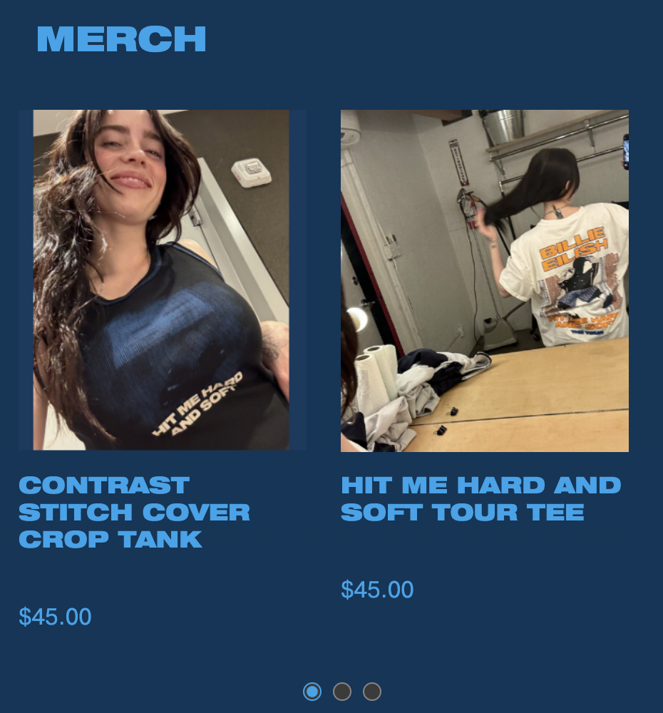

# Procesverslag

Markdown is een simpele manier om HTML te schrijven.  
Markdown cheat cheet: [Hulp bij het schrijven van Markdown](https://github.com/adam-p/markdown-here/wiki/Markdown-Cheatsheet).

Nb. De standaardstructuur en de spartaanse opmaak van de README.md zijn helemaal prima. Het gaat om de inhoud van je procesverslag. Besteedt de tijd voor pracht en praal aan je website.

Nb. Door _open_ toe te voegen aan een _details_ element kun je deze standaard open zetten. Fijn om dat steeds voor de relevante stuk(ken) te doen.

## Jij

  
uitwerken voor kick-off werkgroep

### Auteur:

Giulietta Sipos

#### Je startniveau:

Blauw

#### Je focus:

Surface plane

## Je website

  
uitwerken voor kick-off werkgroep

### Je opdracht:

[Billie Eilish Shop](http://web.archive.org/web/20240822181821/https://store.billieeilish.com/)

#### Screenshot(s) van de eerste pagina (small screen):

Home pagina  
 

#### Screenshot(s) van de tweede pagina (small screen):

Product pagina  
 

## Toegankelijkheidstest 1/2 (week 1)

  
uitwerken na test in 2e werkgroep

### Bevindingen

Lijst met de bevindingen die in de test naar voren kwamen:

- De screenreader sloeg sommige stukken over en snapte ik de volgorde niet helemaal van de screenreader.
- Wel had de website de optie gegeven om de nav over te slaan.

## Breakdownschets (week 1)

  
uitwerken na afloop 3e werkgroep

### de hele pagina:

  

### dynamisch deel (bijv menu):

  

## Voortgang 1 (week 2)

  
uitwerken voor 1e voortgang

### Stand van zaken

<strong>Wat goed ging:</strong>

- De opmaak van de html gng redelijk goed. Ik kon me nog goed herinneren wat de volgorde was van de opmaak en heb ik netjes alles op een rijtje gezet.

<strong>Wat niet goed ging:</strong>

- Ik vod het lastig om voor het eerst met de ":root" te werken. Ik snapte niet helemaal hoe ik de kleuren moest aanroepen.

### Agenda voor meeting

| Diya                                                    | Thi                                                    | Giulietta                                                                | Keysha                                                                  |
| ------------------------------------------------------- | ------------------------------------------------------ | ------------------------------------------------------------------------ | ----------------------------------------------------------------------- |
| - Hoe maak je de rating?                                | - Zou ik alles moeten maken van de gekozen pagina's?   | - Hoe laat je bubbels komen uit de cursor?                               | - Hoe maak je verschillende tabs die je kunt openen op dezelfde pagina? |
| - Verschillende tabs openen op dezelfde pagina, filter? | - Hoe zou ik de h2 titels met een streep moeten maken? | - Kun je nu nog veranderen van focus? van responsive naar surface plane? | - Hoe voeg je een tabel samen in carroussel?                            |

### Verslag van meeting

- Creëer verschillende onderdelen op de pagina, en laat herhalende elementen weg. Gebruik `h2::before{}` en `h2::after{}` om strepen toe te voegen aan de titels/kopjes.
- Voeg hover-effecten, transities, opacity, en animaties toe.
- Zoek online naar bubbels-animaties om toe te voegen aan de cursor.
- Je kunt de focus nog veranderen, maar geef dit graag door.
- Let op dat hover-effecten alleen werken met een cursor en niet op een telefoon.
- Maak een grid voor de lijst, of gebruik een grid in de lijst.
- Voor de carrousel kan je de genoemde website gebruiken (student-assistente heeft dit goedgekeurd).

We hebben bij Sanne nagevraagd of we een andere JavaScript-bibliotheek voor de carrousel mochten gebruiken. Dit werd echter niet goedgekeurd, dus we kunnen die carrousel niet toepassen.

## Voortgang 2 (week 3)

  
uitwerken voor 2e voortgang

### Stand van zaken

<strong>Wat goed ging:</strong>

- Ik begon netjes mijn css op orde zetten, dus de
- De video-achtergrond en
- De hamburger menu is me gelukt om toe te voegen.
- Navigatie is gelukt om toe te voegen en werkt ook.

<strong>Wat niet goed ging:</strong>

- Ik had wat moeite met het gebruik van flexbox voor de layout van de producten van mijn wesbite.
- Het was lastig om de juiste grootte te krijgen voor de iconen in de navigatie.

### Agenda voor meeting

| Diya                                                     | Thi                                                            | Giulietta                                       | Keysha                                                                 |
| -------------------------------------------------------- | -------------------------------------------------------------- | ----------------------------------------------- | ---------------------------------------------------------------------- |
| - Hoe maak je de carroussel?                             | - Hoe zet ik de navigatie buttons op de juiste plek?           | - Hoe krijg ik de video goed in de achtergrond? | - Hoe verander je de kleur van een svg?                                |
| - Ik heb wat problemen met nth-of-child, hoe fix ik dit? | - Hoe zet ik het kruisje helemaal naar rechts?                 | - Ik heb geen classes en id's, mag dat?         | - Hoe krijg ik de tweede nav balk?                                     |
|                                                          | - Mijn img nav icons willen niet goed op size, hoe fix ik dit? | - Hoe maak je de nav sticky?                    | - Waarom is er aan de bovenkant van mijn site een kleine pijl te zien? |

### Verslag van meeting

- Bepaal goed welke elementen op de site links of knoppen moeten zijn.
- Maak twee navigatiemenu’s: één voor het hamburger-menu en één voor de zoekknop, inloggen, winkelmandje, etc.
- Gebruik `justify-self: end;` om het kruisicoon aan de rechterkant te plaatsen (zie oefening 2 over grid).
- Gebruik `filter: invert(1);` om iconen wit of zwart te maken.
- Gebruik `nth-of-type` in plaats van `nth-child` voor betere volgorde in de opmaak.
- Controleer in inspect mode met de pijltool of er ongewenste ruimtes door padding of marges zijn en verwijder deze indien nodig.
- Verwijder zoveel mogelijk classes en ID's en gebruik liever pseudoklassen.

## Toegankelijkheidstest 2/2 (week 4)

  
uitwerken na test in 9e werkgroep

### Bevindingen

Ik besefte ik dat ik niet goed mijn toetsenbord had gebruikt om mijn VoiceOver te besturen.
Ik gebruikte alleen tab en niet control, option command H om ook de headings te lezen. Uiteindelijk is het gelukt om goed mijn VoiceOver te laten besturen.

## Voortgang 3 (week 4)

  
uitwerken voor 3e voortgang

### Stand van zaken

<strong>Wat goed ging:</strong>

- De tekst en knoppen bij de producten zien er nu duidelijker uit door wat styling.
- Ik ben goed bezig met het toevoegen van animaties (de hover state) en de website ziet er nu dynamischer uit.

<strong>Wat niet goed ging:</strong>

- De padding en marges op sommige elementen zorgden voor ongewenste witruimtes, wat extra werk vereiste.

### Agenda voor meeting

| Diya                                      | Thi                                                                                                                                      | Giulietta                                                  | Keysha          |
| ----------------------------------------- | ---------------------------------------------------------------------------------------------------------------------------------------- | ---------------------------------------------------------- | --------------- |
| - Tweede menu toevoegen en button stijlen | - Text bij plaatjes, mag dat? Of alles zelf maken?                                                                                       | - Hoe maak ik producten netjes met prijs, button en tekst? | Was er niet bij |
| - Achtergrond weghalen en svg erin        | - Hoe maak ik filter tabs in hamburgernav en op pagina's?                                                                                | - Hoe laat ik tekst springen naar beneden?                 |                 |
|                                           | - De images in collage bewegen mee wanneer je responsive bent                                                                            |                                                            |                 |
|                                           | - Surface plane, website heeft al veel animaties. Tellen die mee voor surface plane als ik die namaak, of moet ik weer nieuwe toevoegen? |                                                            |                 |

### Verslag van meeting

- Plaats geen tekst op de afbeeldingen; je moet ze per afbeelding maken. Het is handig als je goed bent in Photoshop om de tekst te verwijderen.
- Sybren stuurt een CodePen-link voor de filterfunctie.
- De animaties die je kopieert van de originele site tellen mee voor de Surface Plane, maar je kunt altijd extra animaties toevoegen om alle vijf punten van de Surface Plane af te vinken.
- Gebruik `display: flex` en `flex-wrap`.
- Zet een grijze filter over een afbeelding met `::before` (zoek even een video voor uitleg)
- Voeg het tweede menu toe en style de knop: verwijder de achtergrond en voeg een SVG in.

## Eindgesprek (week 5)

  
uitwerken voor eindgesprek

### De uitkomst - karakteristiek screenshots:

  

### Dit heb ik geleerd:

- Ik heb geleerd hoe ik nth-of-type moet gebruiken (voor deze lessen had ik daar nog nooit gebruik van gemaakt)
- Ik heb geleerd hoe ik achtergrond filmpjes kan toevoegen aan mijn website.
- Ik heb geleerd hoe je een hamburger menu moet maken.
  
- Ik denk geleerd te hebben hoe ik een carousel kan maken.
  
- Ik heb geleerd hoe ik een een form kan maken met labels en al.
  

### Dit was lastig/Is niet gelukt:

Het is me niet gelukt om de wesbite een andere kleur te geven door en toggle toe te voegen.

  

## Bronnenlijst

  
continu bijhouden terwijl je werkt

1. [Cursor path voor bubbels die van mijn muis komen](https://chatgpt.com/share/672b8f5e-2154-800e-ada8-3ef1d6b2d20d)
2. [Hoe kan ik een gradient background krijgen?](https://chatgpt.com/share/672b8f1f-e35c-800e-af36-d35858bab1c4)
3. [CSS fouten checker](https://chatgpt.com/share/672b8fab-0864-800e-ac7c-d923093717fb)
4. [Hoe krijg ik text op een plaatje](https://www.w3schools.com/howto/howto_css_image_text.asp)
5. [Carousel](https://codepen.io/shooft/pen/LYwJOEG)

